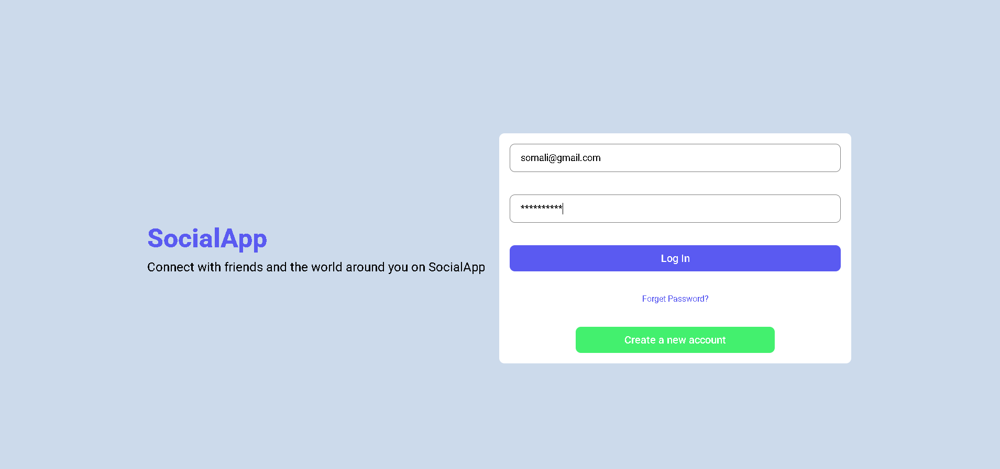
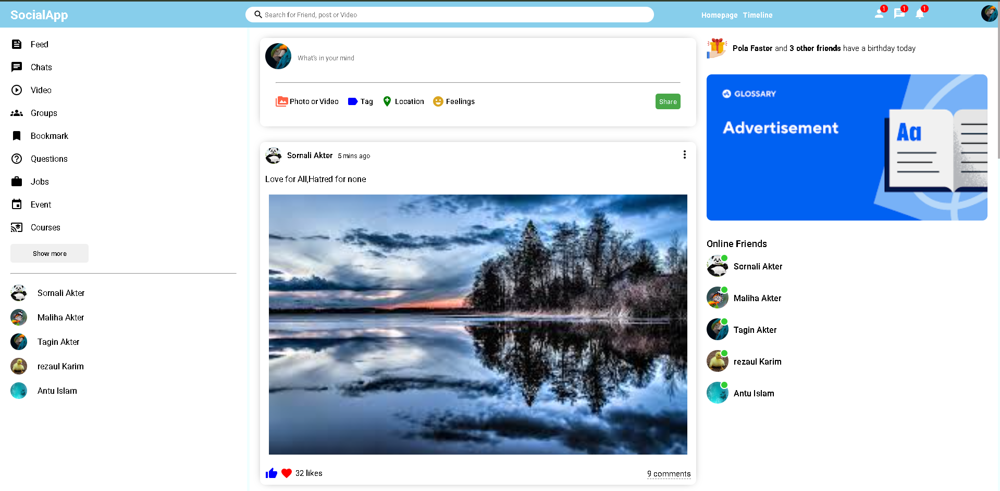
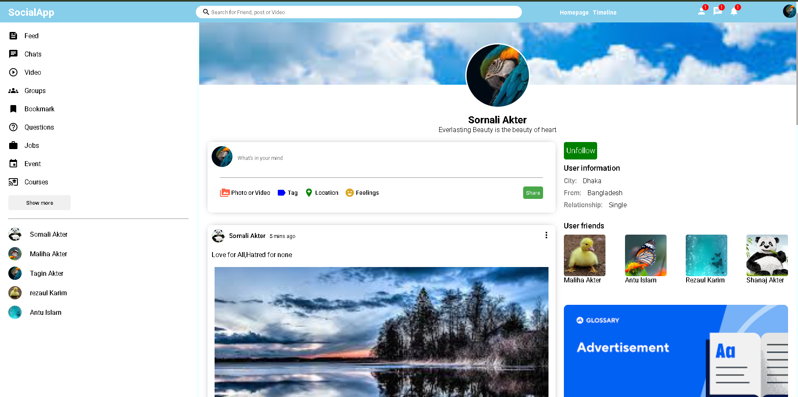

# Social Media App UI (React)

This is a front-end-only design of a social media web application built with **React**. The app includes pages for:

- 🔐 Login
- 📝 Registration
- 🏠 Homepage
- 👤 Profile

🚧 **Note:** This project is focused on **UI/UX design only**. No backend or functional logic (like authentication, posting, or APIs) has been implemented.

---

## 🔥 Demo Screenshot







---

## 🛠️ Tech Stack

- React (with Vite )
- CSS3
- Responsive Layout (Flexbox/Grid)
- React Router (for navigation)

---

## 📁 Project Structure
src/
├── components/
│ ├── login/
│ ├── register/
│ ├── feed/
│ └── closeFriend/
│ ├── online/
│ └── post/
│ ├── topbar/
│ └── rightbar/
│ ├── share/
│ └── sidebar/
├── pages/
│ ├── home/Home.jsx
│ ├── profile/Profile.jsx
├── dummyData.jsx
├── App.jsx
└── main.jsx

---

## 🚀 Getting Started
```bash
# Clone the repo
git clone https://github.com/your-username/social-media-ui-react.git

# Go to the project directory
cd social-media-ui-react

# Install dependencies
npm install

# Start the development server
npm run dev or npx vite

```
📌 License
This project is open-source and free to use for learning and portfolio purposes.

💡 Author
Your Name – Sornali Akter
